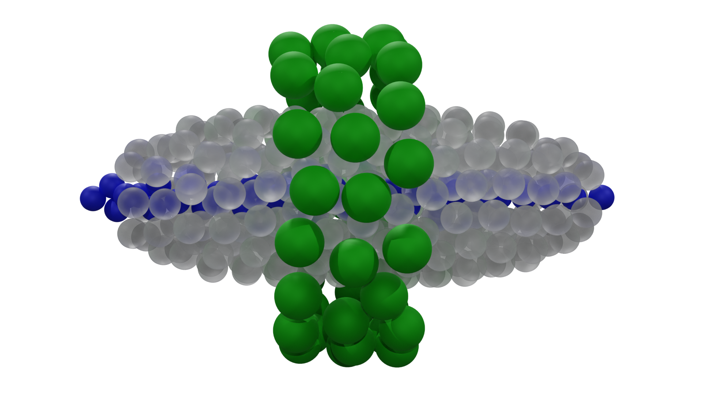
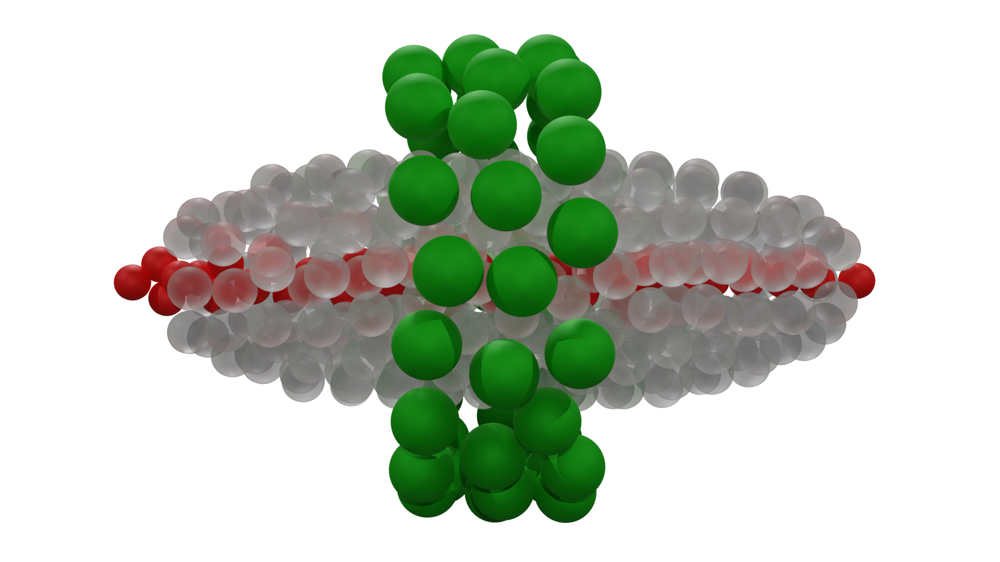
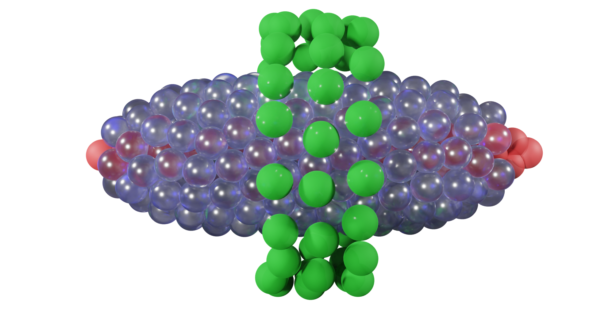

# Coulomb Crystal Plotter:

This program is designed for the plotting of Coulomb crystals for rendering in Blender, animating in PowerPoint and 3D printing, example files can be found in the 'example_inputs' folder.


# Citing this program:
If using this program in academic publications please consider citing us so that others can learn of my research. 
```
@misc{CoulombPlotter,
  author = {Holloway, F},
  title = {CoulombPlotter},
  year = {2023},
  publisher = {GitHub},
  journal = {GitHub repository},
  howpublished = {\url{ttps://github.com/fraseyboo/ion_plotter/master}}
}
```

# Example Plots:

Some of the possible plots you can make with this program:



Colors can be dynamically changed:



The surface roughness allows for different rendering textures:




